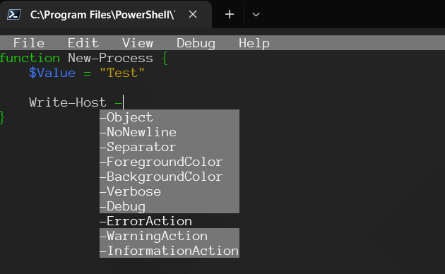

## PSEdit

Edit PowerShell scripts directly in your terminal. 



- IntelliSense
- Syntax Higlighting
- Format on Save
- Script Execution
- Error View
- Syntax Error View

## Installation

This module is available on the [PowerShell Gallery](https://www.powershellgallery.com/packages/psedit). 

```powershell
Install-Module psedit
```

## Editing

To start the editor, you can simply call `Show-PSEditor` in a terminal.

```powershell
Show-PSEditor
```

You can open a file by using the `-Path` parameter.

```powershell
Show-PSEditor -Path .\file.path
```

### Syntax Errors

Syntax errors will be shown in the editor by a red highlight. To view the text of the syntax error, click View \ Syntax Errors.

### Formatting

You can format your code in the editor if you have `PSScriptAnalyzer` installed. To format a script, either press `Ctrl+Shift+R` or click Edit \ Format. If you don't have `PSScriptAnalyzer` installed, you can do so with the command below.

```powershell
Install-Module PSScriptAnalyzer
```

## Theme Support

PSEdit supports customizable themes via a `psedit.json` file in the working directory. If the file is not present, a default theme is used. The theme file allows you to override editor colors for backgrounds, text, errors, and more.

### Example psedit.json

```json
{
	"Theme": {
		"Colors": {
			"Background": "Black",
			"Foreground": "White",
			"Accent": "Cyan",
			"Error": "Red",
			"Warning": "Yellow",
			"Info": "Blue",
			"String": "Brown",
			"Comment": "Green",
			"Secondary": "Gray"
		}
	}
}
```

If a color key is missing, the default value will be used. Changes to the theme file are loaded automatically when the editor starts.

## Execution

To execute your script, press `F5` to run the entire script. If you want to execute a select, you can press `F8`. You can also execute the script in the terminal and exit the editor by pressing `Ctrl+Shift+F5`.

You can also use the Debug menu to access these options.

### Errors

Errors generated when running scripts will be shown in the error window. You can access it by clicking View \ Errors.

### Ironman Software Free Tools

For more free tools, visit the [Ironman Software free tools index](https://ironmansoftware.com/free-powershell-tools). 
